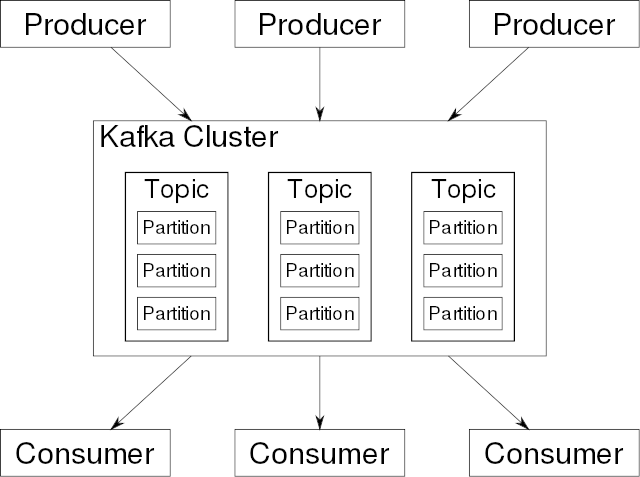
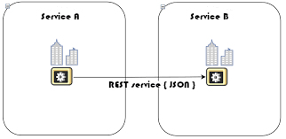
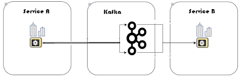

# Kafka?

Kafka is a distributed, horizontally-scalable, fault-tolerant, commit log.

An open source stream processing platform featuring:

- High scalability via **clustered brokers** and **partitioning**
- Fault tolerant via **replication (factor)**
- Low latency, high throughput, where messages/events are appended to fast access files
- Persistent append only logs providing automated data retention

So, at its core, Kafka is a distributed fault tolerant log file. However, it is so much more, including:

- Producer and Consumer APIs for many languages (Kafka itself is written in Scala and Java)
- Kafka Streams and Kafka SQL to transform Kafka data with aggregations, filters etc.
- Kafka Connect to integrate with third party systems such as Databases
- Third party plugins to integrate with the likes of Spark Streaming, Storm, Flink etc.

Applications (**producers**) send messages (**records**) to a Kafka node (**broker**) and said messages are processed by other applications called **consumers**. Said messages get stored in a **topic** (commit log) and consumers subscribe to the topic to receive new messages.

## What are the Two Essentials of any System?

A completely subjective question...

- Low coupling
- High cohesion

## Kafka and Microservices

As microservices have evolved, Kafka has become popular to integrate data between different microservices:

- Asynchronous
  - Realtime
  - Batch

Coupled:

Uncoupled:

## Advantages / Disadvantages

- High-throughput: Kafka is capable of handling high-velocity and high-volume data using not so large hardware. It is capable of supporting message throughput of thousands of messages per second.
- Low latency: Kafka is able to handle these messages with very low latency of the range of milliseconds, demanded by most of new use cases.
- Fault tolerant: The inherent capability of Kafka to be resistant to node/machine failure within a cluster.
- Durability: The data/messages are persistent on disk, making it durable and messages are also replicated so the messages are never lost.
- Scalability: Kafka can be scaled-out without incurring any downtime on the fly by adding additional nodes. The message handling inside the Kafka cluster is fully transparent and these are seamless
- Distributed: Inherently supports distributed architecture making it scalable using capabilities like replication and partitioning.
- Message broker capabilities.
- High concurrency: Capable of handling thousands of messages per second and that too in low latency conditions with high throughput. Kafka allows the reading and writing of messages into it at high concurrency.
- By default persistent: By default, the messages are persistent making it durable and reliable.
- Consumer friendly: Kafka can be integrated with a variety of consumers. Each customer has a different ability to handle these messages coming out of Kafka and because of it's inherent persistence capability, it can behave or act differently according to the consumer that it integrates with. It also integrates well with a variety of consumers written in a variety of languages.
- Batch handling capable

## Disadvantages

- Doesn’t possess a full set of management and monitoring tools. This makes enterprise support staff a bit apprehensive about choosing Kafka and supporting it in the long run. (Not sure this is relevant anymore).
- Kafka only matches the exact topic name and does not support wildcard topic selection, making it incapable of addressing certain use cases.
- API’s which are needed by other languages are maintained by different individuals and corporates, so these can be a problem because of the lack of pace by which these vendors update the connectors.
- Kafka broker and its approach are often attributed to be really simple and uncomplicated in nature. Because of this, other components are used to cater to certain requirements like Zookeeper (state coordination), and MirrorMaker (inter-cluster communication) which may make the deployment and support of the overall architecture problematic for support staff. (Not sure this is relevant anymore).
- Kafka lacks other messaging paradigms like request/reply, point-to-point queues and so on, making it problematic for certain use cases.

## Alternatives

- Actual messaging systems

- - Rabbit MQ
  - Active MQ
  - etc.

