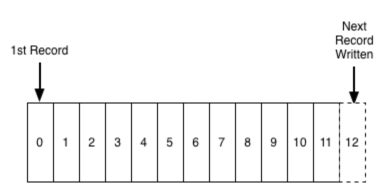

# Architecture

Some boring jargon, which will make more sense later with some pretty diagrams.

## Commit Log

A commit log (also referred to as write-ahead log, transaction log) is a persistent ordered data structure which only supports appends. You cannot modify nor delete records from it. It is read from left to right and guarantees item ordering.

## Topic

A **topic** is a **distributed log file**, where distribution is achieved via **partitions**.

A topic represents a group of files and directories. When a topic is created, this in turn creates directories with the topic name and partition index.

## Publisher / Producer

Processes that publish data (push messages) to the log file associated with a topic.

## Subscriber / Consumer

Processes that read from the log file associated with a topic.

## Partition

Each **partition** is a **file directory** named with the **topic** name and **partiton index**.

A topic is divided into a number of partitions which contain messages as an immutable sequence, allowing multiple consumers to read from a topic in parallel.

## Replication Factor

In a multinode cluster a **replication factor** is set to have multiple copies of each **partition** for **fault tolerance**.

## Leader and Follower

As there will be multiple brokers associated with each **partition** of a given **topic**, one of the brokers will be designated as the **leader**, and the rest are **followers**. Messages are written to and read from this **leader**. These messages are copied by the **followers**. A **follower** is considered an **ISR** if said **follower** could take the place of the **leader** e.g. the **leader** goes down.

## Broker

A Kafka cluster consists of one or more **servers** / **nodes** / **brokers** which are running Kafka. Producers query metadata of each topic and connects to the leader of each partition to produce messages into said topic. Consumers do the same while consuming messages from a topic.

## Offset

The **records** (messages) in the partitions are each assigned a **sequential ID** number called the **offset** that uniquely identifies each **record** with the partition.

---

A producer, whether a CLI or programmatic client, connects to a Kafka cluster by providing a list of Kafka brokers.

Producers connect to one or more brokers and push messages to topics via the leader.

Upon publishing a message to a particular topic, a client is first given the necessary meta data by the cluster. This meta data shows where the partitions of the topic are and which is the leader, so that the client can send the message to the leader.

Consumers pull messages from a topic by polling at regular intervals. Each time a consumer reads messages it needs to keep track of the (log) offset.

High Watermark?

## Zookeeper

Create and manage topics.

Assigns the leader for each partition.

Go through the scenario of publishing a message to a topic with one partition and replication of one. Then keep publishing messages to show that we basically have a bottleneck. Then add a partition. Then add replication…….