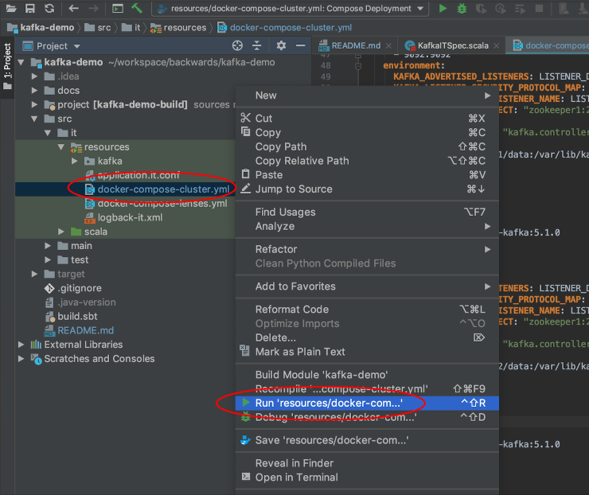
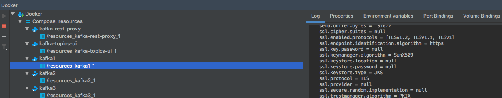

# Commands

## Boot Zookeeper and Kafka Cluster with Docker Compose

We can boot Kafka (and other configured services) with **Docker Compose**. Under the directory [src/it/resources](src/it/resources) are several docker compose files.

Navigate to the [Docker Compose Cluster file](src/it/resources/docker-compose-cluster.yml) and run the default:

```bash
$ docker-compose -f docker-compose-cluster.yml up
```

Or if you have the project open in [IntelliJ](https://www.jetbrains.com/idea/) right click the file and select run (convenient to view logs, environment variables etc):



Which will give you:

- Zookeeper cluster - 3 instances
- Kafka cluster - 3 brokers
- UI  service which can be accessed at [http://localhost:8000](http://localhost:8000)
- REST service which provides the UI access to Kafka


---



Another docker compose file is configured with [Landoop Lenses](https://www.landoop.com/lenses-overview/). Upon running the following, a powerful UI can be accessed at [http://localhost:3030](http://localhost:3030):

```bash
$ docker-compose -f docker-compose-lenses.yml up
```


---


## View Topics

```bash
$ kafka-topics --zookeeper localhost:2181 --list
__confluent.support.metrics
some-topic
```

## Create Topic

```bash
$ kafka-topics --zookeeper localhost:2181 --create --topic thing --partitions 1 --replication-factor 1
Created topic "thing".
```

We can literally have as many partitions as we like to increase throughput.

Replication factor is essentially your backup, which only makes sense with multiple nodes.

## Describe Topic

```bash
$ kafka-topics --zookeeper localhost:2181 --describe --topic thing
Topic:thing	PartitionCount:1	ReplicationFactor:1	Configs:
	Topic: thing	Partition: 0	Leader: 101	Replicas: 101	Isr: 101
```

Where **Replicas** shows a list of the brokers (the **client ID**) for the topic, and the **Leader** shows the **client ID** of the broker that is the acting leader i.e. which broker/partition is handling writes and reads to said topic.

## Produce Messages

```bash
$ kafka-console-producer --broker-list localhost:9092 --topic thing
>Scotland 6
>England 0
```

## Consume Messages

```bash
$ kafka-console-consumer --bootstrap-server localhost:9092 --topic thing
```

At this point you may not see anything. By default the consumer accepts the latest message. This can be changed.

```bash
$ kafka-console-consumer --bootstrap-server localhost:9092 --topic thing --from-beginning
Scotland 6
England 0
Scotland 7
```

## Test Produce/Consume Multiple Messages

```bash
$ kafka-topics --zookeeper localhost:2181 --create --topic mockaroo --partitions 3 --replication-factor 1
Created topic "mockaroo".
```

We are going to get ready made mock data from [Mockaroo](https://mockaroo.com) and pipe it into **kafka-console-producer**. Mockaroo generates mock datasets (and we can stipulate how many records we desire up to 1000). We run the following script providing the name of the topic where the automatically generated data should be published.

Within [it/resources/kafka](it/resources/kafka):

```bash
$ ./mockaroo.sh mockaroo
  % Total    % Received % Xferd  Average Speed   Time    Time     Time  Current
                                 Dload  Upload   Total   Spent    Left  Speed
100    67    0    67    0     0     91      0 --:--:-- --:--:-- --:--:--    91
>>  % Total    % Received % Xferd  Average Speed   Time    Time     Time  Current
                                 Dload  Upload   Total   Spent    Left  Speed
100    54    0    54    0     0     69      0 --:--:-- --:--:-- --:--:--    69
>>  % Total    % Received % Xferd  Average Speed   Time    Time     Time  Current
                                 Dload  Upload   Total   Spent    Left  Speed
100    65    0    65    0     0     83      0 --:--:-- --:--:-- --:--:--    83
```

(Enter **q or Q** to quit the script)

As the messages are generated and piped to **kafka-console-producer**, and then the messages end up in Kafka, we could view 3 separate log files (under [src/it/resources/kafka](src/it/resources/kafka)) for the 3 partitions and see them grow in size. If Kafka was booted with Landoop, we can view the UI:


---


Let's set up **kafka-console-consumer** to actually see the messages consumed from Kafka which were indeed produced as described:

```bash
$ kafka-console-consumer --bootstrap-server localhost:9092 --topic mockaroo
1,Pablo,Velti,pvelti0@trellian.com,Male,172.15.112.192
1,Anna-diane,Ellacombe,aellacombe0@miibeian.gov.cn,Female,17.128.217.84
1,Mady,McKew,mmckew0@miibeian.gov.cn,Female,125.232.240.214
1,Orelie,Barefoot,obarefoot0@huffingtonpost.com,Female,1.37.16.153
1,Elwira,Easman,eeasman0@prweb.com,Female,81.15.87.76
1,Patrick,Fiander,pfiander0@nature.com,Male,198.210.101.236
1,Dona,Eason,deason0@studiopress.com,Female,43.248.196.61
1,Fred,Hatwell,fhatwell0@symantec.com,Female,100.58.28.161
```

A consumer can either start consuming from:

- Beginning of the log
- Await the latest entry i.e. point at the end of the log
- Start at a specific index as the consumer can save said index

```bash
$ kafka-console-consumer --bootstrap-server localhost:9092 --topic mockaroo --from-beginning
```

## Performance Test Produce/Consume Multiple Messages

https://stackoverflow.com/questions/40131580/is-there-any-simulator-tool-to-generate-messages-for-streaming

kafka-producer-perf-test

## Delete Topic

```bash
$ kafka-topics --zookeeper localhost:2181 --delete --topic thing
Topic thing is marked for deletion.
Note: This will have no impact if delete.topic.enable is not set to true.
```

