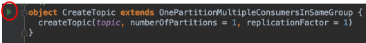

# Scala

## Unit Tests

```bash
$ sbt test
```

## Integration Tests

```bash
$ sbt it:test
```

Note that all tests have **no assertions** - for a demo this is for illustration purposes only (assertions are boring in a demo).

Also (again for demonstration purposes), colourful console output is mainly used instead of logging.

## Run Scenarios

There are multiple scenarios that can be run within the **it** directory where each scenario is made up of individual applications that should be executed in **order**. The following will show all applications available but you will have to actually view the **source code** to see the required order to run said applications.

```bash
$ sbt it:run

Multiple main classes detected, select one to run:

 [1] com.backwards.kafka.scenario.Schemas
 [2] com.backwards.kafka.scenario.SimplestOnePartitionOneConsumer
 [3] com.backwards.kafka.scenario.four.ConsumerA
 [4] com.backwards.kafka.scenario.four.ConsumerB
 ...
```

The easiest way to run the scenarios (to get the correct ordering of processes), is within IntelliJ.

E.g. scenario [OnePartitionMultipleConsumersInSameGroup.scala](../src/it/scala/com/backwards/kafka/two/OnePartitionMultipleConsumersInSameGroup.scala):

- Run **CreateTopic**

  


- Run **ConsumerA**

  


- Run **ConsumerB**

  


- Run **Producer**

  


---

Kafka really only know about **bytes**.

## ADT

In our application / services, we don't deal in bytes. Ideally with deal with **Algebraic Data Types** (ADT).

When our ADT meets Kafka, we need to **serialize** our ADT to bytes to be able to commit to a Kafka topic. Then upon consuming the bytes we wish to reverse that process and **deserialize** said bytes back to our ADT. However, since services are decoupled, an ADT in one system is probably different from that of another. In fact different systems may well be coded in different languages. So we need our systems to communicate via some form of protocol that is agnostic to the chosen technologies. Examples are **JSON**, **Avro** and **Protobuf**.

## JSON

JSON is used a lot with micro services, especially when third parties interact. However, internally other formats are more appropriate, such as Avro or Protobuf.

## Avro

```bash
$ brew install avro-tools
```

Provides CLI tools to view Avro such as converting binary Avro to JSON.

What exactly is [Avro](https://avro.apache.org/docs/current/)?

Avro is a language-independent serialization library. To do this Avro uses a schema which is one of the core components. It **stores the schema in a file for further data processing**.

A key feature of Avro is robust support for data schemas that change over time - often called schema evolution. Avro handles schema changes like missing fields, added fields and changed fields; as a result, old programs can read new data and new programs can read old data.